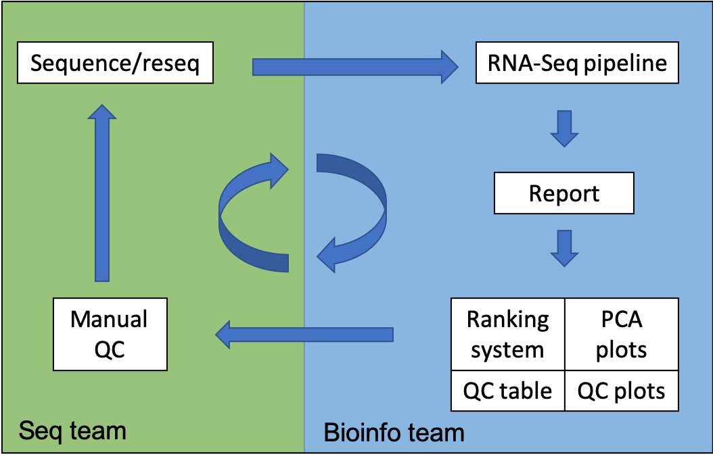

**LJI RNASEQ QC PIPELINE**
======
* Niu Du (ndu [at] lji.org)
* AY and VIJAY labs
* La Jolla Institute for Immunology (LJI)
* La Jolla, CA USA
* Current version: 1.4 (03/18/2020)
------
## Summary

This pipeline was implemented for RNA-Seq data mapping, QC as part of the interactive work flow between sequence and bioinfomatics team. The overall guildline for scuccessful excution a data preprocessing step is as follows:

The pipeline was developed in Sun Grid Engine (SGE) environment however can be can be implemented in any cluster and cloud environments with proper modifications.

Make sure the following tools have been installed on the server

[fastp](https://github.com/OpenGene/fastp) |
[STAR-seq mapping](https://github.com/alexdobin/STAR) |
[Qualimap](http://qualimap.bioinfo.cipf.es/) |
[Samtools](http://www.htslib.org/) |
[Deeptools](https://deeptools.readthedocs.io/en/develop/index.html)
